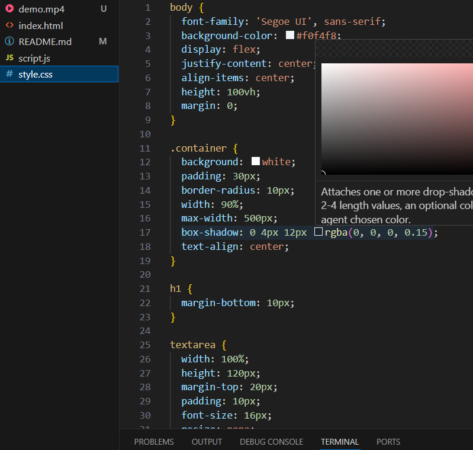

# TypeSpeed

What I Learned is
- Real-time word counting logic

The real-time word counter with automatic disabling of the input when the timer ends — it feels smooth and accurate!
If I had more time, I would:
- Highlight typing mistakes from a reference paragraph
- Add leaderboard or scores history

[Watch the demo](demo.mp4)

